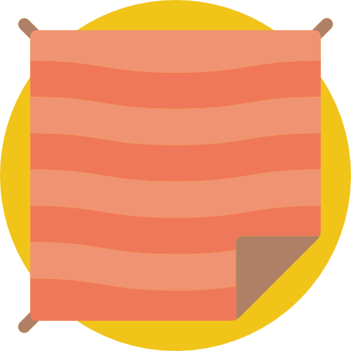

<div align="center">
    
    <h1 align="center">Blanket</h1>
    <a href="https://gitlab.com/thecb4/blanket/-/commits/main">
      
    </a>
    
    
    
    <a href="https://twitter.com/_thecb4">
      
    </a>
</div>

<hr/>

## Display Code Coverage data in a lovely format

## License

This project is licensed under the MIT License - see the [LICENSE.md](LICENSE.md) file for details

## Getting Started

These instructions will get you a copy of the project up and running on your local machine for development and testing purposes. See deployment for notes on how to deploy the project on a live system.

## Built With

* [TextTable](https://github.com/cfilipov/TextTable) - TextTable
* [ArgumentParser](https://github.com/apple/swift-argument-parser) - Swift Argument Parser

### Prerequisites

Swift 5.2

### Installing

Package Manager

```
.package(url: "https://gitlab.com/thecb4/blanket.git", .branch("master"))
```

## Using

using this is very straight forward

with mint
```swift
mint run https://gitlab.com/thecb4/blanket blanket
```

after the initial run

```swift
mint run blanket
```

And results look like

```shell
🌱  Finding latest version of blanket
🌱  blanket 0.1.1 already installed
🌱  Running blanket 0.1.1...
╒════════════════════════════════════════════╤═════════╤═════════════════╤════════════╤═══════════╤═══════════════════╤════════════╤═══════╤═══════════════╤════════════╕
│ File                                       │ Regions │ Region Coverage │ Coverage % │ Functions │ Function Coverage │ Coverage % │ Lines │ Line Coverage │ Coverage % │
╞════════════════════════════════════════════╪═════════╪═════════════════╪════════════╪═══════════╪═══════════════════╪════════════╪═══════╪═══════════════╪════════════╡
│ Sources/BlanketCLI/CLI.swift               │      14 │              11 │         78 │        10 │                 9 │         90 │    40 │            37 │         92 │
├────────────────────────────────────────────┼─────────┼─────────────────┼────────────┼───────────┼───────────────────┼────────────┼───────┼───────────────┼────────────┤
│ Sources/BlanketKit/Blanket.swift           │     147 │               6 │          4 │        29 │                 3 │         10 │   274 │            26 │          9 │
├────────────────────────────────────────────┼─────────┼─────────────────┼────────────┼───────────┼───────────────────┼────────────┼───────┼───────────────┼────────────┤
│ Sources/BlanketKit/CoverageSummary.swift   │       8 │               8 │        100 │         8 │                 8 │        100 │    25 │            25 │        100 │
├────────────────────────────────────────────┼─────────┼─────────────────┼────────────┼───────────┼───────────────────┼────────────┼───────┼───────────────┼────────────┤
│ Sources/BlanketKit/String+Extensions.swift │       5 │               4 │         80 │         1 │                 1 │        100 │    10 │            10 │        100 │
├────────────────────────────────────────────┼─────────┼─────────────────┼────────────┼───────────┼───────────────────┼────────────┼───────┼───────────────┼────────────┤
│ Sources/BlanketKit/Transformer.swift       │      13 │              13 │        100 │        13 │                13 │        100 │    43 │            43 │        100 │
├────────────────────────────────────────────┼─────────┼─────────────────┼────────────┼───────────┼───────────────────┼────────────┼───────┼───────────────┼────────────┤
│ Total                                      │     187 │              42 │        100 │        61 │                34 │         55 │   392 │           141 │         35 │
╘════════════════════════════════════════════╧═════════╧═════════════════╧════════════╧═══════════╧═══════════════════╧════════════╧═══════╧═══════════════╧════════════╛
```

### Break down into end to end tests

Explain what these tests test and why

```
swift test
```

## Documentation

Documentation can be found [here](https://gitlab.com/thecb4/blanket/-/wikis/home)

## Roadmap and Contributing

### Versioning

We use [SemVer](http://semver.org/) for versioning. For the versions available, see the [tags on this repository](https://github.com/your/project/tags).


### Roadmap

Please read [ROADMAP](ROADMAP.md) for an outline of how we would like to evolve the library.

### Contributing

Please read [CONTRIBUTING.md](CONTRIBUTING.md) for details on our code of conduct, and the process for changes to us.

### Changes

Please read [CHANGELOG](CHANGELOG.md) for details on changes to the library.


## Authors

* **'Cavelle Benjamin'** - *Initial work* - [thecb4](https://thecb4.io)

## Acknowledgments

* icon made by [SmashIcons](https://www.flaticon.com/authors/smashicons) from [Flaticon](https://www.flaticon.com)
* Docs generated by [swift-doc](https://github.com/thecb4/swift-doc) originally created by [mattt](https://github.com/mattt)
